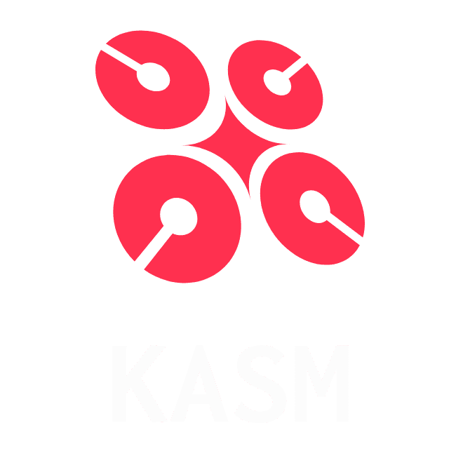

<!-- PROJECT LOGO -->

  
  

    Kick-Ass Security Machine Collation of security tools to aid in Digital Forensics/Incident Response (DFIR) and Threat Hunting.
      
    
    
    <a href="https://github.com/ezaspy/KASM/network/members">
      
    
    
    </a>
      
    </a>
    
      
  

<!-- TABLE OF CONTENTS -->

## Table of Contents

- [About](#about)
  - [Related Projects](#related-projects)
- [Configuration](#Installation/Configuration)
  - [KASM VM](#KASM-VM)
  - [KASM Script](https://github.com/ezaspy/elrond/blob/main/elrond/CONFIG.md)
- [Acknowledgements](#acknowledgements)

  

<!-- ABOUT -->

## About

Kick-Ass Security Machine (KASM) has been primariliy created as an all-in-one Digital Forensics/Incident Response, Threat Hunting (DFIR-TH) pre-packaged virtual machine. KASM is full of invaluable forensics, malware analysis, threat intelligence and security analytics tools to aid, assist and automate with conducting Digital Forensics/Incident Response (DFIR) and Threat Hunting. The main reason for creating this VM is that when I have encountered environments where regular access to the Internet is extremely limited making the installation of additional software very difficult. KASM should have everything you need top revent the reliance on having to install additional software. As new software and toolsets get released and reviewed, they will be added to the VM and relevant scripts. 

### Related Projects

A lot of the scripts and software installed in KASM has come from developing [elrond](https://github.com/ezaspy/elrond). 
   

<!-- PREREQUISITES -->

## Installation/Configuration

### KASM-VM

- Download [KASM-VM](https://drive.google.com/file/d/1BjL3DUoE2-V7AwXCUFhmHuwQoThd48l_/view?usp=sharing) OVA, which is the latest version of SIFT with all of the software packages required by KASM, pre-installed.
- Alternatively, follow the instructions below...
  

### KASM-Script

There are several software package required for using elrond but almost all of them are contained within the [SANS SIFT Worksation](https://www.sans.org/tools/sift-workstation/) virtual machine OVA. However, for the software which is not included, I have provided a script ([config.sh](https://github.com/ezaspy/KASM/blob/main/config.sh)) which installs and configures the additional software. 
To invoke the script, simply follow the instructions in [CONFIG.md](https://github.com/ezaspy/elrond/blob/main/KASM/CONFIG.md#configuration). **Note: you will only need to run the config.sh script once, per KASM instance**

- [SANS SIFT Workstation](https://digital-forensics.sans.org/community/downloads) (20.04)
  - Note: SANS SIFT 18.04 is not supported.
- [CONFIG.md](https://github.com/ezaspy/KASM/blob/main/KASM/CONFIG.md) to install and configure the additional software for SIFT 20.04.
  - If you encounter errors with [CONFIG.md](https://github.com/ezaspy/KASM/blob/main/KASM/CONFIG.md), individual scripts for each of the software packages are contained in [.../KASM/scripts/](https://github.com/ezaspy/KASM/tree/main/KASM/tools/scripts/)
   

<!-- ACKNOWLEDGEMENTS -->

## Acknowledgements

- [Desktop Background](https://www.canva.com/design/DAFQt9mHyiQ/sj_cMIlhHUAbQPiyLYR5TA/edit?utm_source=onboarding#)
- [SIFT](https://www.sans.org/tools/sift-workstation/)
- [VMware](https://www.vmware.com/uk/products/workstation-player.html)
- [VirtualBox](https://www.virtualbox.org)
- [nmap](https://nmap.org)
- [Visual Studio Code](https://code.visualstudio.com)
- [Greenbone](https://www.greenbone.net/en/)
- [MISP](https://www.misp-project.org)
- [TheHive](https://thehive-project.org)
- [Cuckoo](https://cuckoosandbox.org)
- [REMnux](https://docs.remnux.org)
- [oscybershop](https://oscybershop.herokuapp.com/main/index.html)
  
