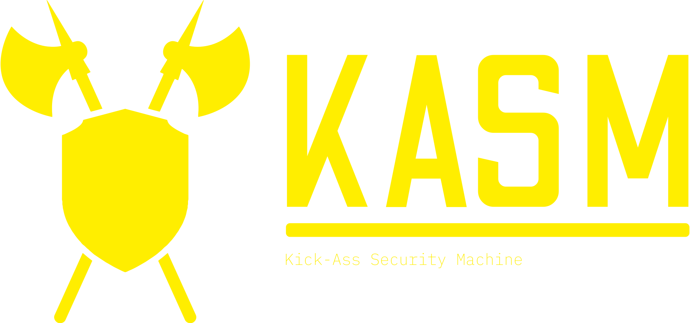

<!-- PROJECT LOGO -->

  
    
  

    Collation of security toolsets, frameworks and projects to assist folks during Digital Forensics/Incident Response (DFIR) investigations, Threat Hunting, Malware Analysis and OSINT Gathering
      
    
    
    <a href="https://github.com/ezaspy/KASM/network/members">
      
    
    </a>
      
    </a>
    
      
  

<!-- TABLE OF CONTENTS -->

# Table of Contents

- [About](#about)
  - [Related Projects](#related-projects)
- [Usage](#usage)
- [Configuration](#configuration)
  - [KASM Virtual Machine](#kasm-virtual-machine)
  - [KASM Configuration Script](https://github.com/ezaspy/elrond/blob/main/elrond/BUILD.md)
- [Acknowledgements](#acknowledgements)

  

<!-- ABOUT -->

# About

Kick-Ass Security Machine (KASM) has been primarily created as an all-in-one Digital Forensics/Incident Response, Threat Hunting (DFIR-TH) pre-packaged virtual machine. KASM is full of invaluable forensics, malware analysis, threat intelligence and security analytics tools to aid, assist and automate with conducting Digital Forensics/Incident Response (DFIR) and Threat Hunting. The main reason for creating this VM is that when I have encountered environments where regular access to the Internet is extremely limited making the installation of additional software very difficult. 
KASM should have everything you need whilst alleviating the reliance on having to install additional software. As new software and toolsets get released and reviewed, they will be added to the VM and relevant scripts. All of the included toolsets and software are referenced in [Acknowledgements](#acknowledgements). 

### Related Projects

A lot of the scripts and software installed in KASM has come from developing [elrond](https://github.com/ezaspy/elrond). 
   

<!-- PREREQUISITES -->

# Usage

`sudo /home/ninja/Desktop/./kick-ass.sh` 

All of the main tooling is accessible via a web browser at **127.0.0.1**:

- **GreenBone**:&nbsp;&nbsp;&nbsp;&nbsp;&nbsp;127.0.0.1:**9392** 
- &nbsp;&nbsp;&nbsp;&nbsp;&nbsp;**TheHive**:&nbsp;&nbsp;&nbsp;&nbsp;&nbsp;127.0.0.1:**9000** 
- &nbsp;&nbsp;&nbsp;&nbsp;&nbsp;&nbsp;&nbsp;&nbsp;&nbsp;&nbsp;&nbsp;**MISP**:&nbsp;&nbsp;&nbsp;&nbsp;&nbsp;127.0.0.1:**443** 
- &nbsp;&nbsp;&nbsp;&nbsp;&nbsp;&nbsp;&nbsp;&nbsp;**Splunk**:&nbsp;&nbsp;&nbsp;&nbsp;&nbsp;127.0.0.1:**8000** 
- &nbsp;&nbsp;&nbsp;&nbsp;&nbsp;&nbsp;&nbsp;&nbsp;**Kibana**:&nbsp;&nbsp;&nbsp;&nbsp;&nbsp;127.0.0.1:**9201** 
- &nbsp;&nbsp;&nbsp;**Navigator**:&nbsp;&nbsp;&nbsp;&nbsp;&nbsp;127.0.0.1/**attack-navigator** 
- &nbsp;&nbsp;&nbsp;&nbsp;&nbsp;&nbsp;&nbsp;**Cuckoo**:&nbsp;&nbsp;&nbsp;&nbsp;&nbsp;127.0.0.1:**8080** 

  

<!-- PREREQUISITES -->

# Configuration

## KASM Virtual Machine

**Recommended Method** 
Download the [KASM Virtual Machine](https://drive.google.com/file/d/1BjL3DUoE2-V7AwXCUFhmHuwQoThd48l_/view?usp=sharing) OVA, which is the latest version of SIFT (20.04) with additional software packages, pre-installed.
> __Note__ - Last Updated: **DEC-2022** 

## KASM Configuration Script
Follow the instructions in [BUILD.md](https://github.com/ezaspy/KASM/blob/main/kasm/BUILD.md).&nbsp;&nbsp;**_Please read the instructions carefully._**
> __Note__ - Last Updated: **DEC-2022** 

  

<!-- ACKNOWLEDGEMENTS -->

# Acknowledgements

- [Desktop Background](https://www.canva.com/design/DAFQt9mHyiQ/sj_cMIlhHUAbQPiyLYR5TA/edit?utm_source=onboarding#)
- [Logo](https://app.logo.com/dashboard/logo_e2285b91-8ee8-4900-a40a-96da8d0ded1e/your-logo-files)
- [SIFT](https://www.sans.org/tools/sift-workstation/)
- [bruce](https://github.com/ezaspy/bruce.git)
- [gandalf](https://github.com/ezaspy/gandalf.git)
- [elrond](https://github.com/ezaspy/elrond.git)
- [VMware](https://www.vmware.com/uk/products/workstation-player.html)
- [VirtualBox](https://www.virtualbox.org)
- [nmap](https://nmap.org)
- [Visual Studio Code](https://code.visualstudio.com)
- [Greenbone](https://www.greenbone.net/en/)
- [MISP](https://www.misp-project.org)
- [TheHive](https://thehive-project.org)
- [REMnux](https://docs.remnux.org)
- [Cuckoo](https://cuckoosandbox.org)
- [jupyter](https://jupyter.org)
- [Bookstack](https://github.com/BookStackApp/BookStack.git)
- [TZWorks](https://tzworks.com/)
- [BlueTeamPowerShell](https://blueteampowershell.com)
- [Registry Viewer](https://accessdata.com/product-download/registry-viewer-2-0-0)
- [SIGMA](https://github.com/SigmaHQ/sigma.git)
- [DeepBlueCLI](https://github.com/sans-blue-team/DeepBlueCLI.git)
- [KAPE](https://github.com/EricZimmerman/KapeFiles.git)
- [PowerForensics](https://github.com/Invoke-IR/PowerForensics.git)
- [MemProcFS](https://github.com/ufrisk/MemProcFS.git)
- [Sysmon](https://learn.microsoft.com/en-us/sysinternals/downloads/sysmon)
- [WMIExplorer](https://github.com/vinaypamnani/wmie2/)
- [CobaltStrike-Defence](https://github.com/MichaelKoczwara/Awesome-CobaltStrike-Defence)
- [Metasploit](https://www.metasploit.com)
- [HTTrack](https://github.com/xroche/httrack.git)
- [Maltego](https://www.maltego.com)
- [freq](https://github.com/MarkBaggett/freq.git)
- [dnstwist](https://github.com/elceef/dnstwist.git)
- [rdap](https://github.com/ezaspy/rdap.git)
- [sherlock](https://github.com/sherlock-project/sherlock.git)
- [TweetScraper](https://github.com/jonbakerfish/TweetScraper.git)
- [karma](https://github.com/Dheerajmadhukar/karma_v2.git)
- [oscybershop](https://oscybershop.herokuapp.com/main/index.html)
  
